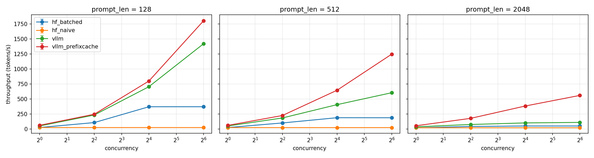
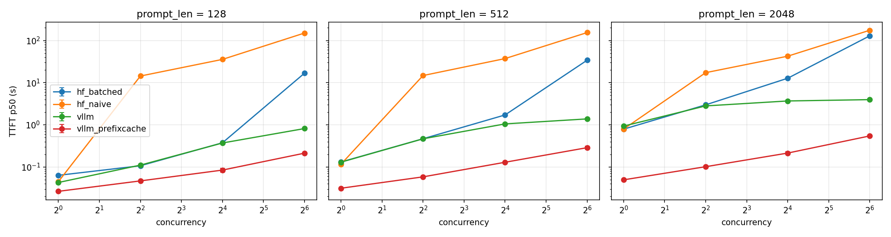

# llm-lab: LLM inference experiments on a single T4

Measured, reproducible experiments on LLM serving and compression, run on one free Kaggle **Tesla T4 (15 GiB)** with **Qwen2.5-1.5B-Instruct** in fp16. Every number in the reports traces back to a raw result file and a script in this repo.

## Status

| Experiment | Question | Status |
|---|---|---|
| **Exp 1: Serving and batching** | How much do batching and the serving engine matter under concurrency? | Done: [REPORT.md](REPORT.md) |
| **Exp 2: Quantization** | What do INT8 / INT4 cost and buy in memory, latency, throughput and quality? | Script ready (`src/quantize.py`), results pending |
| **Exp 3: Prefix caching** | How much does a shared prefix help, and how does it scale with prefix length? | Preliminary: the extreme case (100% shared prompt) is in the Exp 1 report. The shared-prefix-length sweep is planned |

## Exp 1 in one table

Output throughput in tokens/s at **64 concurrent requests**, 128 generated tokens per request (mean of 3 repeats):

| Prompt tokens | HF naive | HF batched | vLLM | vLLM + prefix cache |
|---:|---:|---:|---:|---:|
| 128 | 27 | 373 | 1419 | 1801 |
| 512 | 26 | 190 | 606 | 1246 |
| 2048 | 23 | 53 | 113 | 561 |

Time to first token (p50) at 64 concurrent requests, queueing included:

| Prompt tokens | HF naive | HF batched | vLLM | vLLM + prefix cache |
|---:|---:|---:|---:|---:|
| 128 | 150.4 s | 16.8 s | 0.816 s | 0.213 s |
| 512 | 154.3 s | 34.1 s | 1.38 s | 0.288 s |
| 2048 | 175.1 s | 129.1 s | 3.96 s | 0.546 s |




## What the numbers say

- **Batching is worth far more than any single kernel.** One-request-at-a-time serving stays flat at 23 to 27 tok/s no matter the load. Static batching (up to 16 requests) multiplies throughput by 13.9x / 7.2x / 2.3x for 128 / 512 / 2048-token prompts.
- **A continuous-batching engine beats static batching by 3.8x / 3.2x / 2.1x** (128 / 512 / 2048 tokens), and keeps TTFT in the sub-second to few-second range where static batching queues for 17 to 129 s.
- **The advantage shrinks as prompts get longer.** At 2048 tokens the T4 is prefill-bound (about 2190 prompt tokens/s) and vLLM saturates by concurrency 16.
- **Prefix caching is the biggest single lever when prompts share a prefix:** 1.27x / 2.06x / 4.98x throughput at 64 concurrent requests for 128 / 512 / 2048 tokens when every request uses the same prompt. That is an upper bound, not a typical gain.
- **A methodology bug was caught and fixed.** The first vLLM run used identical prompts with prefix caching on, which inflated its numbers. It is kept as `vllm_prefixcache` and re-measured with caching off (see REPORT.md, section 4).

## Setup

| | |
|---|---|
| GPU | Tesla T4, 15360 MiB, driver 580.178.04 (Kaggle, one GPU pinned) |
| Model | Qwen/Qwen2.5-1.5B-Instruct, fp16 (the T4 has no bf16) |
| vLLM | 0.30.0 (torch 2.13.0+cu132), max-model-len 4096, gpu-memory-utilization 0.85 |
| Transformers servers | transformers 5.0.0, torch 2.10.0+cu128, Python 3.12.13 |
| Workload | closed loop, streaming `/v1/completions`, prompts of 128 / 512 / 2048 tokens, 128 forced output tokens, concurrency 1 / 4 / 16 / 64, 3 repeats |

## Repository layout

```
llm-lab/
├── README.md
├── REPORT.md                  # full Exp 1 report with all tables and caveats
├── src/
│   ├── bench_inference.py     # load generator (TTFT, latency, throughput, peak memory)
│   ├── hf_server.py           # Transformers baseline: one generate() at a time
│   ├── hf_batched_server.py   # Transformers baseline: static batching
│   └── quantize.py            # Exp 2: FP16 / INT8 / NF4 study (run + summarize)
├── results/                   # raw JSON per run, all_runs.csv, summary.csv, env files
├── plots/
└── logs/                      # server logs (KV cache size, prefix-cache hit rates)
```

## Reproduce

On Kaggle (GPU T4 x2, internet on), pin one GPU with `CUDA_VISIBLE_DEVICES=0`, start a server, then run the client:

```bash
# vLLM with prefix caching disabled
vllm serve Qwen/Qwen2.5-1.5B-Instruct --dtype float16 --max-model-len 4096 \
    --gpu-memory-utilization 0.85 --no-enable-prefix-caching --port 8000

python src/bench_inference.py --model Qwen/Qwen2.5-1.5B-Instruct --backend-name vllm \
    --prompt-len 512 --max-tokens 128 --requests-per-level 4 --out results/vllm_p512_r0.json
```

The Transformers baselines are started with `python src/hf_server.py --model ...` and `python src/hf_batched_server.py --model ... --max-batch 16 --max-wait-ms 20`, and benchmarked with the same client.

## Known caveats

- The raw `hf_batched_*.json` files were lost with a Kaggle draft session and rebuilt from the run's printed log (full float precision). `results/hf_batched_SOURCE.txt` documents this. Re-running that backend takes about 20 minutes.
- All requests share one prompt per level and one output length, so head-of-line blocking is not exercised. See REPORT.md, section 6, for the full list.
