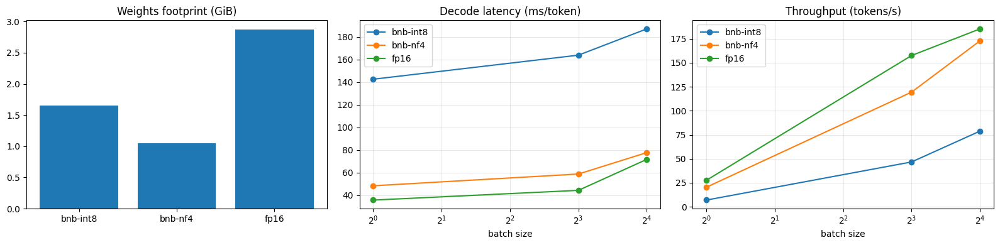

# Exp 2: Quantization on a single T4

*Qwen2.5-1.5B-Instruct, Kaggle Tesla T4, bitsandbytes INT8 and NF4 against FP16. Last updated 2026-10-02.*

## Abstract

We measure what 8-bit and 4-bit weight quantization cost and buy for a 1.5B-parameter model under Hugging Face Transformers on a T4. NF4 shrinks the weights to 0.36x of FP16 (2.75x smaller) and raises WikiText-2 perplexity by 8.0%, with ARC-Easy accuracy 5.6 points lower. It also decodes more slowly, at 0.74x of FP16 throughput for a single sequence and 0.93x at batch 16. INT8 keeps quality essentially intact (perplexity +0.6%, ARC-Easy -1.0 point) and saves 42% of the weight memory, but bitsandbytes INT8 decodes 2.6x to 4.0x slower than FP16. On this setup, neither format makes inference faster; quantization here is a memory trade, and INT8 is a poor one.

## 1. Setup

- **Hardware and software:** Tesla T4 (15360 MiB), transformers 5.0.0, torch 2.10.0+cu128, bitsandbytes 0.50.2, one GPU. Each method runs in its own process and writes one JSON file, so memory and CUDA state never leak between runs.
- **Methods:** `fp16` (reference); `bnb-int8` (LLM.int8() via bitsandbytes); `bnb-nf4` (4-bit NormalFloat, FP16 compute, no double quantization). Embeddings and the output head are not quantized by bitsandbytes.
- **Speed benchmark:** HF `generate()` with greedy decoding, static batches of identical 512-token prompts at batch sizes 1, 8 and 16, 128 new tokens per sequence, one warm-up, 3 timed repeats (means reported). *Prefill* is the time for a 1-token generation; *decode latency* is `(total time - prefill) / 127` per step; *throughput* is `batch x 128 / total time` and therefore includes prefill. *Peak memory* is `torch.cuda.max_memory_allocated()` reset before each batch size.
- **Runs:** the tables use a full Kaggle commit run, and its raw files are in `results/`. An earlier interactive run of the same code gave identical perplexity and ARC-Easy results, and throughput within 7.4% (all nine cells were slower in the second run). Absolute speeds therefore carry a few percent of run-to-run variation, while the ratios between methods are more stable.
- **Quality:** WikiText-2 test perplexity over non-overlapping 2048-token windows (299,078 tokens, 146 full windows, no BOS), computed in float32 from the logits; ARC-Easy zero-shot multiple choice on the first 500 test questions, scored by answer log-likelihood (`acc`: summed log-probability; `acc_norm`: divided by answer length in characters). Perplexities are only comparable between methods run with this exact protocol.

## 2. Results

### Memory and quality

| Method | Weights (GiB) | vs FP16 | WikiText-2 PPL | PPL change | ARC-Easy acc | ARC-Easy acc_norm |
|---|---:|---:|---:|---:|---:|---:|
| FP16 | 2.875 | 1.00x | 9.649 | +0.0% | 0.750 | 0.756 |
| INT8 (bitsandbytes) | 1.655 | 0.58x | 9.704 | +0.6% | 0.740 | 0.740 |
| NF4 (bitsandbytes) | 1.045 | 0.36x | 10.417 | +8.0% | 0.694 | 0.702 |

### Speed (batch size 1, 8, 16; 512-token prompts, 128 new tokens)

Prefill time (s):

| Method | batch 1 | batch 8 | batch 16 |
|---|---:|---:|---:|
| FP16 | 0.103 | 0.868 | 1.945 |
| INT8 (bitsandbytes) | 0.241 | 1.123 | 2.224 |
| NF4 (bitsandbytes) | 0.144 | 1.112 | 1.978 |

Decode latency (ms per token per step):

| Method | batch 1 | batch 8 | batch 16 |
|---|---:|---:|---:|
| FP16 | 35.7 | 44.3 | 71.7 |
| INT8 (bitsandbytes) | 142.6 | 163.8 | 187.1 |
| NF4 (bitsandbytes) | 48.4 | 58.8 | 77.7 |

Throughput (generated tokens/s, includes prefill):

| Method | batch 1 | batch 8 | batch 16 |
|---|---:|---:|---:|
| FP16 | 27.6 | 157.6 | 185.3 |
| INT8 (bitsandbytes) | 7.0 | 46.7 | 78.8 |
| NF4 (bitsandbytes) | 20.4 | 119.4 | 172.8 |

Throughput relative to FP16:

| Method | batch 1 | batch 8 | batch 16 |
|---|---:|---:|---:|
| FP16 | 1.00x | 1.00x | 1.00x |
| INT8 (bitsandbytes) | 0.25x | 0.30x | 0.43x |
| NF4 (bitsandbytes) | 0.74x | 0.76x | 0.93x |

Peak GPU memory (GiB, allocated):

| Method | batch 1 | batch 8 | batch 16 |
|---|---:|---:|---:|
| FP16 | 2.94 | 3.36 | 3.83 |
| INT8 (bitsandbytes) | 1.73 | 2.15 | 2.62 |
| NF4 (bitsandbytes) | 1.20 | 1.61 | 2.08 |



## 3. Analysis

### 3.1 Why the saving is 1.7x and 2.8x, not 2x and 4x

Qwen2.5-1.5B has 1.54B parameters, of which about 0.23B are the token embeddings (a 151,936-token vocabulary by 1,536 hidden units, shared with the output head). bitsandbytes leaves these in FP16, which is 0.43 GiB on its own. The rest, about 1.31B parameters, is what gets quantized. The arithmetic matches the measured footprints: 0.43 GiB + 1.31B bytes (INT8) is about 1.66 GiB, and 0.43 GiB + 1.31B x 0.5 bytes (NF4) is about 1.04 GiB. The parameter counts come from the model card. For small models with large vocabularies, the unquantized embedding is a sizeable floor on what quantization can save.

### 3.2 Quality

INT8 is essentially lossless on both measures: perplexity +0.57% and ARC-Easy -1.0 point. The standard error of a single 500-question accuracy near 0.75 is about 1.9 points, so the INT8 difference is within noise. NF4 is a visible step down: perplexity +8.0% and ARC-Easy -5.6 points (acc_norm -5.4). That ARC gap is larger than the single-accuracy standard error, but we did not run a paired significance test, so we call it a likely, not a certain, degradation.

### 3.3 Speed: quantization did not make this model faster

- **NF4** is slower at small batch (0.74x of FP16 throughput at batch 1) and nearly catches up at batch 16 (0.93x). Both the prefill and the decode steps pay for dequantizing weights on the fly. The extra per-step cost is roughly fixed, so a larger batch amortizes it.
- **INT8** is the slowest by a wide margin: decode takes 2.6x to 4.0x longer per step than FP16, and prefill at batch 1 takes 2.3x longer. The usual reason is that bitsandbytes' LLM.int8() path handles activation outliers with a mixed-precision decomposition, which adds overhead that a small model on a T4 cannot hide. We did not profile this, so treat it as the likely explanation, not a measured one.
- A plausible reason none of this helps is that decoding a model this small is dominated by fixed per-step overhead rather than by reading weights, so fewer bytes per weight do not shorten a step. We did not test this. Formats with kernels built for them may behave differently, which this study does not cover (see section 6).

### 3.4 Peak memory

At batch 16 the peak allocated memory is 3.83 GiB for FP16, 2.62 GiB for INT8 and 2.08 GiB for NF4. NF4 uses 46% less than FP16 at this batch, a smaller relative saving than for the weights alone, because activations and the KV cache are not quantized. On a 15 GiB card none of the three is memory-constrained for this model, so the saving matters only when the model or the batch is much larger.

## 4. Practical takeaways

For a 1.5B model on a T4 with HF Transformers and bitsandbytes:

1. **If the model fits, use FP16.** It is the fastest and the most accurate.
2. **If you must save memory, prefer NF4 over INT8 with bitsandbytes.** NF4 is smaller (1.04 against 1.66 GiB) and has 2.2x to 2.9x the throughput of INT8, at the price of about 8% perplexity.
3. **Use bitsandbytes INT8 only when you need near-lossless quality in less memory and can accept 2.6x to 4.0x slower decoding.**
4. **Do not expect a speedup from quantization by default.** It depends on the kernels. Measure before assuming.

## 5. Limitations

- One model, one GPU type, bitsandbytes only. Results for AWQ, GPTQ or larger models may differ, especially on speed.
- Speed is measured through HF `generate()` with static batches of identical prompts, not through a serving engine, and with one prompt length (512) and one output length (128).
- Quality uses two benchmarks with a fixed protocol (non-overlapping windows for perplexity, the first 500 ARC-Easy questions). ARC-Easy has about a 1.9-point standard error at this size, and no paired significance test was run.
- Means over 3 repeats; the standard deviations are stored in `results/quant_*.json` and were not analyzed here.
- Causes given in 3.3 are hypotheses; none was isolated with a profiler.

## 6. What comes next

- **Kernel-optimized 4-bit formats** (AWQ or GPTQ checkpoints, loaded through the same `quantize.py` with `--method prequant`) to test whether the slowdown is a property of 4-bit weights or of bitsandbytes.
- **Quantization combined with serving** (a quantized model behind vLLM) to answer how serving strategy and compression interact.
- **Exp 3**, the prefix-caching sweep over shared-prefix length.

## 7. Reproducibility

`src/quantize.py` writes one JSON per method (`results/quant_fp16.json`, `quant_bnb-int8.json`, `quant_bnb-nf4.json`) and `python src/quantize.py summarize` merges them into `results/quant_summary.csv`. The Kaggle notebook that ran it clones this repository and runs each method in its own process.

```bash
python src/quantize.py run --method fp16 --out results/quant_fp16.json
python src/quantize.py run --method bnb-int8 --out results/quant_bnb-int8.json
python src/quantize.py run --method bnb-nf4 --out results/quant_bnb-nf4.json
python src/quantize.py summarize --results-dir results --out results/quant_summary.csv
```
