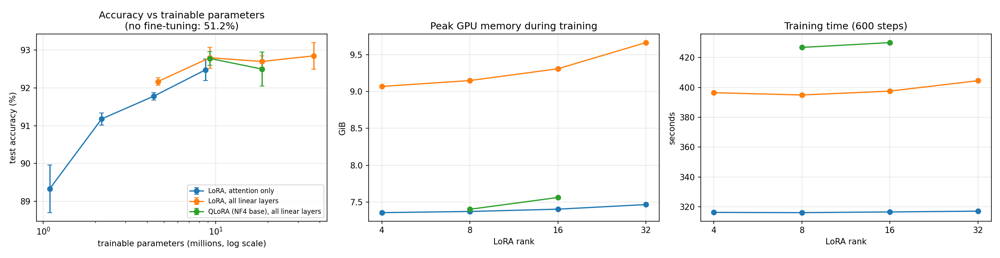

# Exp 4: LoRA and QLoRA fine-tuning on a single T4

*Qwen2.5-1.5B-Instruct, 6-way emotion classification, Kaggle Tesla T4. LoRA implemented from scratch in PyTorch. Last updated 2026-10-03.*

## Abstract

We implement LoRA from scratch and fine-tune Qwen2.5-1.5B-Instruct on emotion classification (`dair-ai/emotion`), varying the adapter rank (4 to 32), the layers that get adapters (attention only or all linear layers) and the precision of the frozen base (fp16 for LoRA, NF4 for QLoRA), with 3 seeds per configuration (31 runs in total). Fine-tuning lifts test accuracy from 51.2% to 92.8% at best. When all linear layers are adapted, accuracy is flat from rank 8 (92.80%) to rank 32 (92.85%) while the trainable parameters grow 4x. When only attention is adapted, accuracy keeps rising with rank (89.3% to 92.5%). QLoRA at rank 8 matches LoRA (92.78% against 92.80%) with 19% less peak memory for 8% more training time.

## 1. Setup

**Task and data.** The model receives an instruction and a text and must continue with one of six emotion names (sadness, joy, love, anger, fear, surprise). Training uses the first 16,000 examples of the train split; evaluation uses the 2,000 test examples. The validation split is not used, and nothing was selected on the test set.

**Metric.** No text is generated. We compare the next-token logits of the first token of each label word and take the largest, then report accuracy and macro-F1. The pipeline checks that the six first tokens are distinct.

**LoRA from scratch.** Each adapted linear layer computes `y = W x + (alpha / r) * B(A(dropout(x)))`, with `W` frozen, `A` initialized with Kaiming-uniform, `B` initialized to zero, dropout 0.05, and `A`, `B` kept in fp32. It wraps any base layer, including bitsandbytes 4-bit layers, because it only calls the base layer and adds its own output. "Attention" wraps `q, k, v, o` (112 modules over 28 layers); "all linear layers" adds `gate, up, down` (196 modules). Each run first checks that injecting the adapters does not change the model's output (they start at zero), and the trainable counts match `r x (in + out)` per module, for example 9,232,384 at rank 8 on all layers.

**Training.** AdamW, learning rate 2e-4, no weight decay, 5% warmup then linear decay, 600 steps at batch size 16 (9,600 examples, about 0.6 epoch), maximum length 128, gradient clipping 1.0, fp16 autocast with loss scaling (the T4 has no bf16), loss on the answer tokens only, and `alpha = 2 x rank` so the scaling factor `alpha / r` is constant. Seeds 0, 1 and 2 change the adapter initialization and the data order. Hyperparameters were fixed in advance and not tuned per configuration.

**Measurements.** Peak memory is `torch.cuda.max_memory_allocated()` during training only (after model load). Training time covers the 600 steps.

**Environment.** Tesla T4; Python 3.13.15, torch 2.11.0+cu128, transformers 5.16.1, bitsandbytes 0.50.2. This is a newer Kaggle image than the one used for Exp 1 and 2 (Python 3.12.13, torch 2.10.0, transformers 5.0.0), and the versions are stored in every result file.

## 2. Results

Mean over 3 seeds (± standard deviation across seeds); the no-fine-tuning row is a single evaluation.

| Method | Adapted layers | Rank | Trainable params | % of model | Test accuracy (%) | Macro-F1 (%) | Peak memory (GiB) | Train time (s) | Final train loss |
|---|---|---:|---:|---:|---:|---:|---:|---:|---:|
| No fine-tuning | - | - | 0 | 0 | 51.2 | 40.0 | - | - | - |
| LoRA | attention | 4 | 1.09M | 0.07% | 89.33 ± 0.63 | 83.67 ± 0.53 | 7.36 | 316 | 0.328 |
| LoRA | attention | 8 | 2.18M | 0.14% | 91.18 ± 0.16 | 85.69 ± 0.27 | 7.37 | 316 | 0.241 |
| LoRA | attention | 16 | 4.36M | 0.28% | 91.78 ± 0.10 | 86.37 ± 0.34 | 7.40 | 317 | 0.217 |
| LoRA | attention | 32 | 8.72M | 0.57% | 92.48 ± 0.28 | 87.34 ± 0.39 | 7.47 | 317 | 0.195 |
| LoRA | all linear | 4 | 4.62M | 0.30% | 92.17 ± 0.10 | 87.35 ± 0.35 | 9.07 | 397 | 0.187 |
| LoRA | all linear | 8 | 9.23M | 0.60% | 92.80 ± 0.28 | 87.83 ± 0.32 | 9.15 | 395 | 0.162 |
| LoRA | all linear | 16 | 18.46M | 1.20% | 92.70 ± 0.15 | 87.64 ± 0.55 | 9.31 | 398 | 0.153 |
| LoRA | all linear | 32 | 36.93M | 2.40% | 92.85 ± 0.35 | 87.45 ± 0.78 | 9.66 | 405 | 0.134 |
| QLoRA | all linear | 8 | 9.23M | 0.60% | 92.78 ± 0.18 | 88.03 ± 0.04 | 7.40 | 427 | 0.160 |
| QLoRA | all linear | 16 | 18.46M | 1.20% | 92.50 ± 0.45 | 87.25 ± 0.92 | 7.56 | 430 | 0.149 |



## 3. Analysis

### 3.1 Fine-tuning does the heavy lifting

Without any training the model scores 51.2% on this prompt. Every configuration reaches at least 89.3%, and the best reach about 92.8%, a gain of 42 points from tuning less than 2.5% of the parameters.

### 3.2 Rank saturates when all layers are adapted

With adapters on all linear layers, rank 4 reaches 92.17% and ranks 8, 16 and 32 reach 92.80%, 92.70% and 92.85%, a spread of 0.15 points. Going from rank 8 to 32 quadruples the trainable parameters (9.2M to 36.9M) for +0.05 points. For scale, the standard error of an accuracy near 92.8% on 2,000 test examples is about 0.6 points and the seed standard deviations are between 0.10 and 0.63 points, so differences of a few tenths of a point are not resolvable here. The final training loss still falls with rank (0.187, 0.162, 0.153, 0.134), so the extra capacity fits the training data faster without improving test accuracy at this training budget.

### 3.3 With attention only, rank matters much more

Adapting only `q, k, v, o` makes accuracy climb steadily with rank: 89.33%, 91.18%, 91.78% and 92.48% for ranks 4 to 32, a gain of 3.1 points. When the number of trainable parameters is matched, adapting all linear layers is slightly ahead: attention rank 16 (4.36M) gets 91.78% against 92.17% for all-layer rank 4 (4.62M), and attention rank 32 (8.72M) gets 92.48% against 92.80% for all-layer rank 8 (9.23M). The gaps (0.39 and 0.32 points) are about four and one seed standard deviations of the configurations compared (0.10 and 0.28 points), and both are smaller than the 0.6-point standard error from the finite test set, so we call this suggestive, not conclusive. The price of adapting all layers is 25% more training time (395 s against 316 s) and 1.8 GiB more peak memory.

### 3.4 QLoRA matches LoRA on this task

At rank 8 QLoRA reaches 92.78% against 92.80% for LoRA (-0.02 points) and a macro-F1 of 88.03% against 87.83%. It uses 19% less peak memory (7.40 against 9.15 GiB) and trains 8% slower (427 s against 395 s) because every forward and backward pass dequantizes the base weights. At rank 16 QLoRA is 0.20 points lower (92.50% against 92.70%), within the seed noise (its standard deviation is 0.45 points). The relative saving is smaller than the weight saving measured in Exp 2 (2.9 to 1.0 GiB), because activations, not weights, dominate training memory.

### 3.5 Where the memory goes

Peak memory is mostly activations (no gradient checkpointing is used). The fp16 weights take 2.9 GiB, and the adapters, their gradients and the Adam state for 9.2M trainable parameters add only about 0.14 GiB, yet the peak is 9.1 GiB. The rank has a small effect (9.07 to 9.66 GiB from rank 4 to 32). Adapting the MLP layers adds memory because their inputs are wide (8,960 units). Our adapter also keeps an fp32 copy of each adapted layer's input for the backward pass, which a library implementation may avoid, so the absolute memory figures are specific to this implementation. That explanation is a hypothesis; we did not test it.

## 4. Practical takeaways

For a roughly 1.5B model on a single T4 and a classification task like this one:

1. **Adapt all linear layers with a small rank (8) by default.** It reaches the best accuracy in this study, and rank 32 adds 4x the parameters for no measurable gain.
2. **If you adapt attention only, spend the budget on rank.** Accuracy kept improving up to rank 32 there.
3. **If memory is the constraint, use QLoRA at rank 8.** It cost no measurable accuracy here, saved about 19% of peak memory and added about 8% to the training time.
4. **Do not read the ordering of ranks 8, 16 and 32 as meaningful** when all layers are adapted; the differences are within noise.

## 5. Limitations

- One model, one task, one GPU. The rank-saturation result applies to this training budget (600 steps, about 0.6 epoch) and to a fixed learning rate and `alpha = 2 x rank`. Larger ranks may need a different learning rate or longer training.
- The test set has 2,000 examples (standard error about 0.6 points) and each configuration has 3 seeds; no significance tests were run.
- The LoRA implementation is verified by structural checks (zero effect at initialization, parameter counts), and in Exp 5 its forward pass and its merged weights matched PEFT exactly when both used the same adapter weights. The initialization and the training dynamics were not compared with PEFT.
- Memory and speed numbers belong to this implementation and to this environment (see section 1).
- Macro-F1 is below accuracy because the classes are imbalanced; we did not analyze per-class results.
- The environment differs from Exp 1 and 2, so absolute speeds are not comparable across experiments.

## 6. Reproducibility

`src/train_lora.py` writes one JSON per run (`results/lora_*.json`, including an environment block), and `python src/train_lora.py summarize` merges them into `results/lora_summary.csv` (mean and standard deviation per configuration) and `results/lora_all_runs.csv` (every run). The figure comes from `python src/plot_lora.py`.

```bash
python src/train_lora.py run --mode zeroshot --out results/lora_zeroshot.json
python src/train_lora.py run --mode lora --rank 8 --targets all --seed 0 --out results/lora_lora_r8_all_s0.json
python src/train_lora.py run --mode qlora --rank 8 --targets all --seed 0 --out results/lora_qlora_r8_all_s0.json
python src/train_lora.py summarize --results-dir results --out results/lora_summary.csv
python src/plot_lora.py --summary results/lora_summary.csv --out plots/lora_overview.png
```

## 7. What comes next

- Compare the initialization and a short training run of the from-scratch LoRA with PEFT (the forward pass and merging were already checked in Exp 5).
- Longer training and a learning-rate sweep, to test whether the rank saturation holds with a larger budget.
- Exp 5: implement an attention block and a small GPT from scratch and compare them with the Hugging Face implementation numerically.
