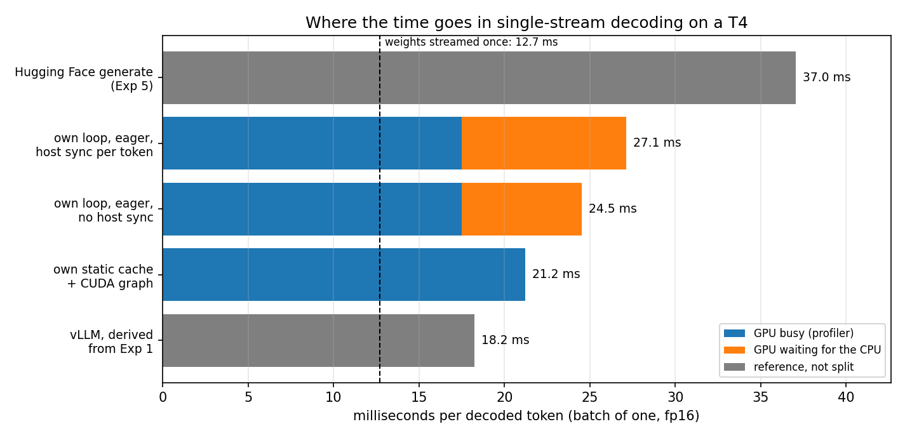

# Exp 6: Where does single-stream decode time go on a T4?

*Profiling the from-scratch decoder of Exp 5 with Qwen2.5-1.5B-Instruct in fp16, batch of one, on a Kaggle Tesla T4. Last updated 2026-10-05.*

## Abstract

Exp 1 and Exp 5 suggested that single-stream decoding of a 1.5B model is limited by per-step overhead rather than by GPU work, and that this explains most of vLLM's lead at concurrency 1. We tested it by running the same decode step four ways and profiling it. In a plain eager loop the CPU needs as long to enqueue a step as the step takes (about 24.5 ms either way), and the GPU is busy for only 17.5 ms of it, so it idles for about 7.0 ms per token. Capturing the step in a CUDA graph cuts the step time from 27.1 to 21.2 ms (1.28x) and makes it GPU-bound. The GPU work itself is dominated by matrix-vector kernels that take 12.95 ms, close to the 12.7 ms needed to stream the 3.09 GB of weights once at the measured 243 GB/s. Putting these measurements together, about 19.5 ms of Hugging Face's 37.0 ms per token is not GPU work, and vLLM's roughly 18 ms per token sits at the GPU-work level. The hypothesis is supported, with caveats listed below.

## 1. Setup

**Variants of one decode step** (`src/exp6_profiling.py`, built on the decoder of Exp 5 with the fused attention path). All four generate the same tokens, which is checked first in fp32 on a short prompt.

1. *Eager, growing KV cache, host sync per token*: the loop used in Exp 5, which reads the token on the host at every step.
2. *Eager, growing KV cache, no host sync*: the same without the per-token read-back; tokens stay on the GPU.
3. *Eager, preallocated KV cache*: the new key and value are written at a position given by a device tensor, and a mask hides later positions. This removes every host-dependent shape.
4. *CUDA graph*: variant 3 captured once and replayed. The argmax and the position update are inside the graph; the replay and one small copy per step are launched from Python.

**Measurement.** fp16, batch of one, 512-token prompt, 127 decode steps timed per repetition (the prefill is outside the timing), 1 warm-up and 5 timed repetitions. Alongside the step time we record the CPU time that the loop needs only to enqueue the steps, before the final synchronization. If the two are equal, the GPU is waiting for the CPU. A `torch.profiler` pass over 30 steps counts device operations and sums their durations to get the GPU busy time. The achievable memory bandwidth is measured with a large device-to-device copy, and the floor is the time to stream all weights once at that bandwidth.

**Environment.** Tesla T4, Python 3.13.15, torch 2.11.0+cu128, transformers 5.16.1.

## 2. Results

### 2.1 Step time

| Variant | Step time (ms) | CPU time to enqueue a step (ms) | Decode tokens/s | Speed-up vs the Exp 5 loop |
|---|---:|---:|---:|---:|
| Eager, growing KV cache, host sync per token (the Exp 5 loop) | 27.12 | 27.12 | 36.9 | 1.00x |
| Eager, growing KV cache, no host sync | 24.52 | 24.50 | 40.8 | 1.11x |
| Eager, preallocated KV cache, no host sync | 25.08 | 25.07 | 39.9 | 1.08x |
| Preallocated KV cache, step captured as a CUDA graph | 21.22 | 20.26 | 47.1 | 1.28x |

An earlier 2-repetition run gave 27.60, 24.56, 25.38 and 20.25 ms for the four variants, so the figures reproduce within about 5% (the CUDA graph varied most). Standard deviations over the 5 repetitions are in `results/profiling_exp6.json`.

### 2.2 Profiler pass (30 steps)

| Variant | Device operations per step | GPU busy per step (ms) | Step time (ms) | GPU busy / step time |
|---|---:|---:|---:|---:|
| Eager, growing KV cache, no host sync | 1312 | 17.52 | 24.52 | 71% |
| Preallocated KV cache, step captured as a CUDA graph | 1400 | 21.58 | 21.22 | 100% |

The four largest device operations, in milliseconds per step. Kernel names are truncated in the log; the full list is in the JSON file.

| Variant | Matrix-vector kernel 1 | Matrix-vector kernel 2 | Matrix-vector kernel 3 | Attention kernel (CUTLASS memory-efficient, sm75) |
|---|---:|---:|---:|---:|
| Eager, growing cache | 7.25 | 3.46 | 2.24 | 0.99 |
| Static cache, CUDA graph | 7.59 | 3.70 | 2.36 | 1.79 |

### 2.3 Memory floor

The weights occupy 3.09 GB. A large copy on this T4 reaches 243 GB/s, so streaming the weights once takes at least 12.7 ms per token.



## 3. Analysis

### 3.1 The eager loop is limited by the CPU

For all three eager variants the time the CPU needs to enqueue the steps equals the step time to within 0.03 ms, so the GPU finishes each step as soon as the CPU has launched it and then waits. The profiler agrees: of the 24.52 ms per step, the GPU is busy for 17.52 ms (71%) and idle for about 7.0 ms. One token takes 1312 device operations (kernels and memory operations) in this implementation, which is 18.7 microseconds of CPU time per operation. Reading the token back on the host at every step costs another 2.6 ms.

### 3.2 CUDA graphs remove part of the gap

Replaying the captured step takes 21.22 ms: 1.28x faster than the Exp 5 loop and 1.18x faster than the same step run eagerly. With the graph, the CPU time to enqueue (20.26 ms) is now close to the step time, because the CPU waits for the GPU, which means the step has become GPU-bound.

### 3.3 The GPU work is mostly streaming the weights

The three largest device operations are matrix-vector kernels and together take 12.95 ms, against 12.7 ms to stream the weights once at the measured bandwidth. At batch 1 the weight matrices are read once per token with almost no reuse, so these kernels run at about the bandwidth floor. The remaining 4.6 ms of GPU time are attention (about 1 ms) and the many smaller kernels. This matches what the earlier experiments suggested: the decode step cost barely grows when the batch grows (Exp 1), because the weights are read once per step regardless of the batch.

### 3.4 A caveat: our graph does more GPU work than the eager step

A CUDA graph needs fixed shapes, so the graph variant uses a preallocated cache and attends over all 640 positions with a mask, and it expands the key-value heads with copies. Its GPU busy time is 21.6 ms, about 4.1 ms more than the 17.5 ms of the dynamic variant, and its attention kernel takes 1.79 ms instead of 0.99 ms. The graph's gain against the eager step (3.3 ms) therefore understates what graphs can give when the captured work is as lean as the dynamic step. We did not test a leaner static step, so how close a graph gets to the 17.5 ms of GPU work is an open question here.

### 3.5 A time budget from Hugging Face to vLLM

| Step | Time per token (ms) | Change (ms) |
|---|---:|---:|
| Hugging Face `generate` (Exp 5) | 37.0 | |
| Own eager loop with host sync (this experiment) | 27.1 | -9.9 (the machinery of `generate`) |
| GPU work of that loop (profiler) | 17.5 | -9.6 (host sync 2.6 + launch gaps 7.0) |
| vLLM, derived from Exp 1 | 18.2 | +0.7 |

Of the 37.0 ms per token that `generate` takes, about 9.9 ms is the machinery of generic generation and about 9.6 ms is the gap between the GPU work and our eager loop, which is host synchronization plus kernel-launch gaps. That leaves about 17.5 ms of GPU work, and vLLM's step (derived from its end-to-end throughput and time to first token in Exp 1: `(128 / 52.3 tokens/s - 0.130 s) / 127`) is within a millisecond of it. So the single-stream lead of vLLM over Hugging Face on this GPU is mostly overhead removal, and what remains is bound by streaming the weights.

## 4. Practical takeaways

1. **At batch 1 on a T4 with a 1.5B model, an eager Python loop wastes about 29% of every step** waiting for kernel launches, and a host sync per token adds more.
2. **CUDA graphs fix the launch gaps** if the step can be given fixed shapes. A preallocated cache and a position tensor are enough.
3. **What remains is memory-bound:** about 12.7 ms per token goes to streaming the weights, so a lower weight precision can only help if its kernels are as efficient as these (this suggests why bitsandbytes was slower in Exp 2, but we did not test it).
4. **Do not blame the model for latency before profiling:** here roughly half of Hugging Face's per-token time was not the GPU working.

## 5. Limitations

- One GPU type, one model, one precision, batch of one, one prompt length (512) and 127 decode steps per repetition; 5 repetitions, with variation of a few percent between runs.
- The profiler pass covers 30 steps and sums the durations of device operations, which includes memory operations and carries some profiling overhead. For the graph variant the busy time (21.58 ms) slightly exceeds the step time (21.22 ms), which shows the size of that error (about 2%).
- The graph variant does more GPU work than the dynamic step (section 3.4) and launches two small operations per step from Python.
- The GPU busy time was measured on our implementation, not on the kernels that Hugging Face runs, which may differ. The vLLM figure is derived from a different harness (end-to-end server throughput in Exp 1), so the budget in 3.5 is an approximate accounting, not a single controlled measurement.
- Only the four largest device operations are listed in this report; the rest are in the JSON file.

## 6. Reproducibility

`src/exp6_profiling.py` writes `results/profiling_exp6.json` with an environment block, and `src/plot_exp6.py` builds the figure from that file plus the results of Exp 1 and Exp 5. The Kaggle notebook clones this repository and runs them.

```bash
python src/exp6_profiling.py selftest
python src/exp6_profiling.py run --check --bench --profile --repeats 5 --out results/profiling_exp6.json
python src/plot_exp6.py --results results --out plots/decode_budget.png
```

## 7. What comes next

- Replace the repeated key-value heads and the full-length mask in the static step by grouped-query attention over the filled part of the cache, and test whether the graph then approaches the GPU-busy time of the dynamic step.
- Try `torch.compile` with CUDA graphs on the same step to see how much a compiler recovers without hand-written changes.
- Repeat the budget at larger batch sizes, where the weights are shared across sequences and the balance between overhead and GPU work changes.
